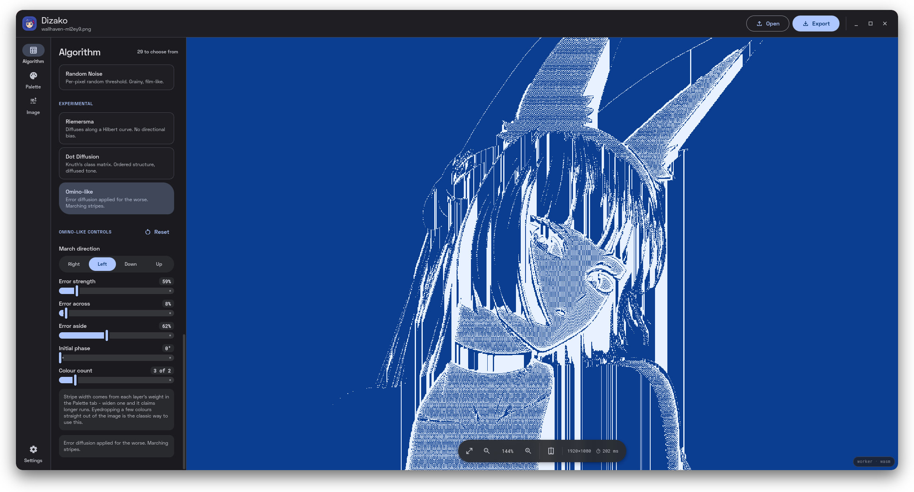
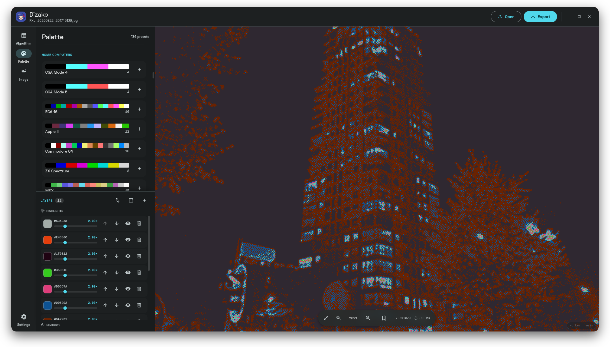
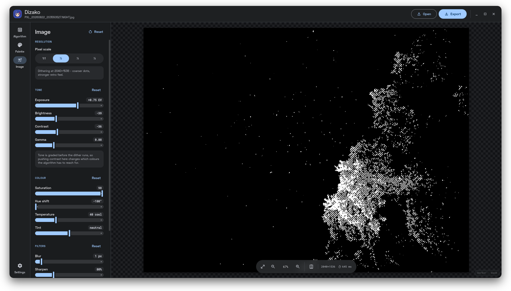

<div align="center">


# Dizako

**A dithering studio.** Load an image, pick from 29 algorithms and 130
palettes, and decide which colours land in the shadows and which in the
highlights.

Built with Tauri, React, and Material 3. Everything runs locally. No uploads,
no tracking.

<table>
  <tr>
    <td align="center" width="33%">
      <a href="screenshots/mockup__algo_1787436742.png">
        
      </a>
      <br />
      <sub>Algorithms</sub>
    </td>
    <td align="center" width="33%">
      <a href="screenshots/mockup_palette_1787437669.png">
        
      </a>
      <br />
      <sub>Palettes</sub>
    </td>
    <td align="center" width="33%">
      <a href="screenshots/mockup__image_1787437379.png">
        
      </a>
      <br />
      <sub>Image</sub>
    </td>
  </tr>
</table>

</div>

---

## What it does

Open an image, choose an algorithm and a palette, tune until it looks right,
then export a PNG. Sliders re-render live. A compare wipe shows original vs
dithered.

| Area | Includes |
| --- | --- |
| **Error diffusion** | Floyd-Steinberg, Jarvis, Stucki, Sierra, Atkinson, and friends |
| **Ordered** | Bayer, halftone screens, line screens, blue noise, checkerboard |
| **Threshold / experimental** | Hard threshold, random noise, Riemersma, dot diffusion, Omino-like |
| **Palette layers** | Colours stacked by tonal position, so you choose what goes where |
| **Image controls** | Exposure, contrast, gamma, saturation, hue, blur, sharpen (before dither) |

## Building

Each platform has its own build script. Both compile the WebAssembly engine, build the frontend, and then bundle the app; neither cross-compiles, so run the one that matches the machine you are on.

| Platform | Script | Produces |
| --- | --- | --- |
| Linux | `./build-all.sh` | `.deb`, `.rpm`, `.AppImage`, Arch `.pkg.tar.zst` |
| Windows | `.\build-win.ps1` | portable `dizako.exe`, NSIS installer |
| macOS | `./build-all.sh macos` | prints the steps only, see below |

### Shared dependencies
Needed on every platform:
- **Core build tools**: Node 22+, `pnpm`, Rust (`cargo`), and `wasm-pack`.
- **Rust Wasm target**: `rustup target add wasm32-unknown-unknown`, or the `rust-wasm` package via `pacman`.

### Linux

```bash
./build-all.sh
```

The script checks for missing dependencies, builds every bundle, and finally installs the Arch package it just produced via `pkexec pacman -U`. Each bundle is best effort, so one failing packager does not kill the rest.

Additional Tauri dependencies: `webkit2gtk-4.1`, `base-devel`, `curl`, `wget`, `openssl`, `appmenu-gtk-module`, `gtk3`, `libvips`, `libayatana-appindicator`. *(On Arch, `./build-all.sh` offers to install these for you via `pkexec pacman`.)*

### Windows

Run from PowerShell **on a Windows machine**:
```powershell
.\build-win.ps1
```

The script validates its tools, compiles the WASM engine, installs dependencies, runs the Tauri build, then collects both binaries into a fresh `release-win/` directory and prints their sizes. You get two artifacts, and they are not interchangeable:

| Artifact | What it is |
| --- | --- |
| `dizako.exe` | Portable standalone build. Launches straight into the GUI with no console window, needs no installation. |
| `Dizako_<version>_x64-setup.exe` | NSIS installer. Setup wizard, Start menu entry, uninstaller. |

Additional Windows requirements:
- **Rust MSVC toolchain** plus the Visual Studio Build Tools (C++ workload). Windows builds use MSVC by default.
- **WebView2**, which is preinstalled on Windows 11 and on current Windows 10.

`.cargo/config.toml` pins a mingw linker for `x86_64-pc-windows-gnu`. That only applies when you explicitly target the GNU toolchain and is ignored by the default MSVC build; delete that section if you want to build the GNU target without mingw present.

Cross-building Windows binaries from Linux needs the NSIS and mingw toolchains (`pacman -S mingw-w64-gcc nsis` or equivalent) and `pnpm tauri build --runner cargo --target x86_64-pc-windows-gnu --bundles nsis`. This is untested, which is why running the script on Windows is the supported path.

### macOS

Scaffolding only, never exercised. `./build-all.sh macos` prints the steps: install the Xcode command line tools, then `pnpm tauri build --bundles dmg,app`.

### Manual build
If you prefer not to use the scripts:
```bash
# Compile the WebAssembly engine first
wasm-pack build dither-wasm --release --target web --out-dir pkg

# Install frontend dependencies
pnpm install

# Run the app
pnpm tauri dev            # development mode
pnpm tauri build          # bundle into src-tauri/target/release/bundle
```

Frontend only: `pnpm dev` / `pnpm build`.

> **Building the AppImage by hand?** Set `NO_STRIP=1`. `bundle.targets` is `"all"`, so a bare `pnpm tauri build` on Linux will try the AppImage, and linuxdeploy ships an old `strip` that chokes on the `.relr.dyn` sections in current system libraries. Without it the bundle fails with an unhelpful `failed to run linuxdeploy`. `./build-all.sh` already sets this for you.

## Matugen theming

Dizako can take its accent colour from [matugen](https://github.com/InioX/matugen):

1. Copy `templates/matugen-template.json` into your matugen templates directory.
2. Point matugen at it:
   ```toml
   [templates.dizako]
   input_path = "~/.config/matugen/templates/dizako-matugen.json"
   output_path = "~/.config/dizako/colors.json"
   ```
3. Run matugen, then pick **Settings → Accent → Matugen** in Dizako.

## License

[MIT](LICENSE) — free to use, modify, and distribute.
