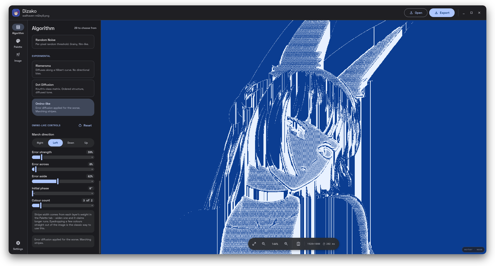
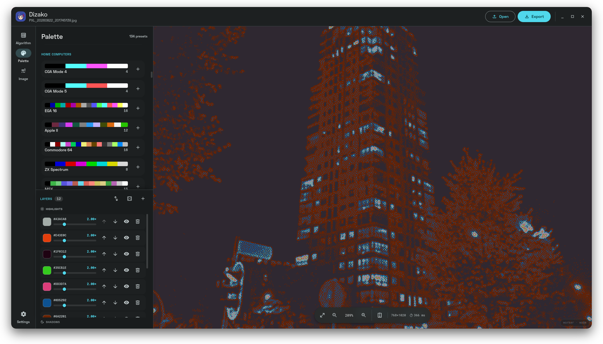
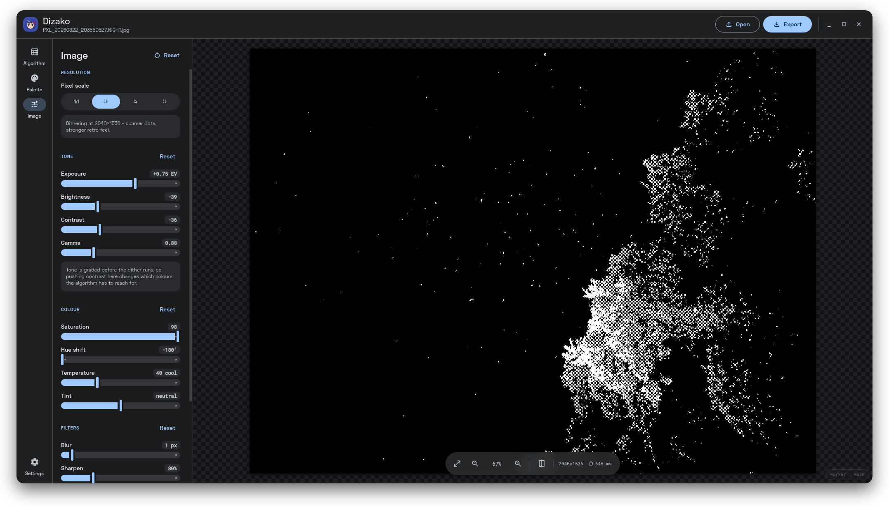

<div align="center">


# Dizako

**A dithering studio.** Load an image *or a video*, pick from 30 algorithms
and 130 palettes, and decide which colours land in the shadows and which in
the highlights.

Built with Tauri, React, and Material 3. Everything runs locally. No uploads,
no tracking.

<table>
  <tr>
    <td align="center" width="33%">
      <a href="screenshots/mockup__algo_1787436742.png">
        
      </a>
      <br />
      <sub>Algorithms</sub>
    </td>
    <td align="center" width="33%">
      <a href="screenshots/mockup_palette_1787437669.png">
        
      </a>
      <br />
      <sub>Palettes</sub>
    </td>
    <td align="center" width="33%">
      <a href="screenshots/mockup__image_1787437379.png">
        
      </a>
      <br />
      <sub>Image</sub>
    </td>
  </tr>
</table>

</div>

---

## What it does

Open an image or a video, choose an algorithm and a palette, tune until it
looks right, then export. Sliders re-render live. A compare wipe shows original
against dithered.

| Area | Includes |
| --- | --- |
| **Error diffusion** | Floyd-Steinberg, Jarvis, Stucki, Sierra, Atkinson, and friends |
| **Ordered** | Bayer, halftone screens, line screens, blue noise, checkerboard, pixel-grid dot halftone |
| **Threshold / experimental** | Hard threshold, random noise, Riemersma, dot diffusion, Omino-like, ASCII / text, JPEG sort |
| **Stacking** | Stack ten or more passes of any mix - experimental ones included - each with its own settings and opacity; editing one pass only recomputes it and the passes above it |
| **Palette layers** | Colours stacked by tonal position, so you choose what goes where; build your own in a floating studio, or reset to the colours the image is actually made of |
| **Image controls** | Exposure, contrast, gamma, saturation, hue, blur, sharpen (before dither) |
| **Video** | Scrub, play and dither footage frame by frame; export MP4, WebM or a PNG sequence |

### Dot Grid

A pixel-grid halftone: the image is read in coarse cells and each cell is redrawn
as one crisp dot sized by the tone beneath it, with paper showing between them.
Controls: cell size, dot shape (square, round, diamond), dot size, cutoff (the
tone below which no dot is drawn), size steps (quantised dot sizes), tone curve,
staggered rows, and a threshold bias.

## Performance

The engine is Rust compiled to WebAssembly and runs in a worker, so the window
never waits on a render. The first preview pass is sized to what renders have
actually been costing (Settings → Performance), the finished result of every
pass in a stack is cached between edits, and video frames are read and encoded
off the UI thread (a transferred `VideoFrame` where the host has WebCodecs, a
worker-side readback elsewhere).

## Video

Drop in an MP4, MOV, WebM or MKV and the whole studio applies to it. The
transport under the canvas scrubs and plays; playback dithers every displayed
frame live at preview resolution and snaps back to full detail the moment you
stop. The two handles on the scrub track set the export range.

Export renders in two phases. Every frame in range is dithered through a pool
of workers - one per core, so a clip renders several times faster than a single
pass could - and kept as a lossless PNG. The frames are then pushed into the
system's own encoder on a fixed clock, so the result runs at exactly the source
frame rate rather than at whatever speed the render managed.

| Format | Notes |
| --- | --- |
| **MP4** | H.264 via the host encoder. The most portable result; offered when the system supports it |
| **WebM** | VP8/VP9. Open codecs, slightly larger files |
| **PNG frames** | One lossless PNG per frame in a folder. Always available, and the right input for ffmpeg or a compositor |

Which of the three you get is decided by what the machine can actually do, not
assumed - the export dialog lists what is available, says why anything is not,
and shows the frame count, working-set size and estimated file size before you
commit to the job. Exported video is silent; audio is not carried through.

Limits: 20 minutes and 4 MP per frame. Longer or larger sources are refused
with an explanation rather than attempted and abandoned.

## Building

Each platform has its own build script. Both compile the WebAssembly engine, build the frontend, and then bundle the app; neither cross-compiles, so run the one that matches the machine you are on.

| Platform | Script | Produces |
| --- | --- | --- |
| Linux | `./build-all.sh` | `.deb`, `.rpm`, `.AppImage`, Arch `.pkg.tar.zst` |
| Windows | `.\build-win.ps1` | portable `dizako.exe`, NSIS installer |
| macOS | `./build-all.sh macos` | prints the steps only, see below |

### Shared dependencies
Needed on every platform:
- **Core build tools**: Node 22+, `pnpm`, Rust (`cargo`), and `wasm-pack`.
- **Rust Wasm target**: `rustup target add wasm32-unknown-unknown`, or the `rust-wasm` package via `pacman`.

### Linux

```bash
./build-all.sh
```

The script checks for missing dependencies, builds every bundle, and finally installs the Arch package it just produced via `pkexec pacman -U`. Each bundle is best effort, so one failing packager does not kill the rest.

Additional Tauri dependencies: `webkit2gtk-4.1`, `base-devel`, `curl`, `wget`, `openssl`, `appmenu-gtk-module`, `gtk3`, `libvips`, `libayatana-appindicator`. *(On Arch, `./build-all.sh` offers to install these for you via `pkexec pacman`.)*

### Windows

Run from PowerShell **on a Windows machine**:
```powershell
.\build-win.ps1
```

The script validates its tools, compiles the WASM engine, installs dependencies, runs the Tauri build, then collects both binaries into a fresh `release-win/` directory and prints their sizes. You get two artifacts, and they are not interchangeable:

| Artifact | What it is |
| --- | --- |
| `dizako.exe` | Portable standalone build. Launches straight into the GUI with no console window, needs no installation. |
| `Dizako_<version>_x64-setup.exe` | NSIS installer. Setup wizard, Start menu entry, uninstaller. |

Additional Windows requirements:
- **Rust MSVC toolchain** plus the Visual Studio Build Tools (C++ workload). Windows builds use MSVC by default.
- **WebView2**, which is preinstalled on Windows 11 and on current Windows 10.

`.cargo/config.toml` pins a mingw linker for `x86_64-pc-windows-gnu`. That only applies when you explicitly target the GNU toolchain and is ignored by the default MSVC build; delete that section if you want to build the GNU target without mingw present.

Cross-building Windows binaries from Linux needs the NSIS and mingw toolchains (`pacman -S mingw-w64-gcc nsis` or equivalent) and `pnpm tauri build --runner cargo --target x86_64-pc-windows-gnu --bundles nsis`. This is untested, which is why running the script on Windows is the supported path.

### macOS

Scaffolding only, never exercised. `./build-all.sh macos` prints the steps: install the Xcode command line tools, then `pnpm tauri build --bundles dmg,app`.

### Manual build
If you prefer not to use the scripts:
```bash
# Compile the WebAssembly engine first
wasm-pack build dither-wasm --release --target web --out-dir pkg

# Install frontend dependencies
pnpm install

# Run the app
pnpm tauri dev            # development mode
pnpm tauri build          # bundle into src-tauri/target/release/bundle
```

Frontend only: `pnpm dev` / `pnpm build`.

### Tests

```bash
pnpm test                 # golden parity: the wasm engine against the committed manifest
pnpm lint
```

`tools/smoke.py` drives the running dev server through a real browser - image
import, video import, playback, canvas navigation, a full video export, and the
error dialog - and checks the canvas actually painted. It needs Playwright and a
Chromium binary and is not part of CI:

```bash
pnpm dev &
python tools/smoke.py http://localhost:1420/
```

> **Building the AppImage by hand?** Set `NO_STRIP=1`. `bundle.targets` is `"all"`, so a bare `pnpm tauri build` on Linux will try the AppImage, and linuxdeploy ships an old `strip` that chokes on the `.relr.dyn` sections in current system libraries. Without it the bundle fails with an unhelpful `failed to run linuxdeploy`. `./build-all.sh` already sets this for you.

## Matugen theming

Dizako can take its accent colour from [matugen](https://github.com/InioX/matugen):

1. Copy `templates/matugen-template.json` into your matugen templates directory.
2. Point matugen at it:
   ```toml
   [templates.dizako]
   input_path = "~/.config/matugen/templates/dizako-matugen.json"
   output_path = "~/.config/dizako/colors.json"
   ```
3. Run matugen, then pick **Settings → Accent → Matugen** in Dizako.

## License

[MIT](LICENSE) — free to use, modify, and distribute.
